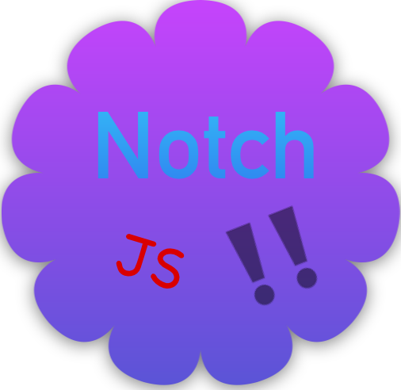

# NotchJS

NotchJS is a JavaScript UI framework with a difference.

## Features

* Modular
* Diagonally scalable
* Was once on Hacker News
* Supports ES2000late
* WASM
* Works out of the notch with **any** cloud provider

## Future

* ICO planned for the near future
* Rust cross compilation (contributors wanted)
* GraphQL support

## Bug reports

If you find a bug, first of all how dare you. Then, either send an electronic mail or fill in an issue on GitHub.